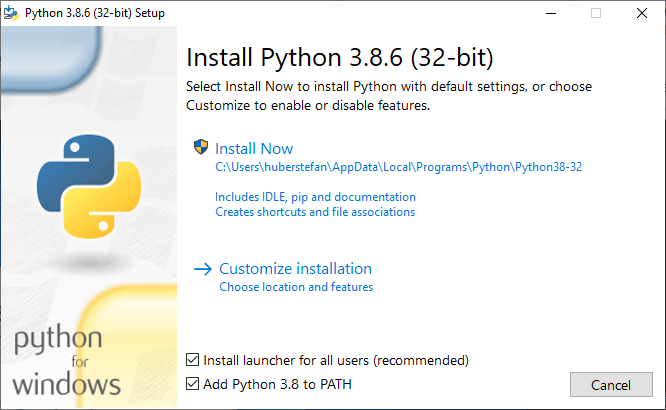

# Python Installation

In diesem Tutorial wird die Installation von Python für Windows beschrieben.

## Einfache Installation

### Installer Auswahl

In den meisten Fällen kann eine einfache Installation der Python Ausführungsumgebung durchgeführt werden. Dazu muss die gewünschte `Installer` von der Python Website heruntergeladen werden. [Hier](https://www.python.org/downloads/windows/) finden sich alle Stable Python Windows Releases.

Für jedes Release (seit Python 3.5) liegen folgende Dateien zum Download vor:

 - Download Windows help file
 - Download Windows x86-64 embeddable zip file
 - Download Windows x86-64 executable installer
 - Download Windows x86-64 web-based installer
 - Download Windows x86 embeddable zip file
 - Download Windows x86 executable installer
 - Download Windows x86 web-based installer

Es ist zu entscheiden ob eine `32-Bit` oder `64-Bit` Version von Python verwendet werden soll. [TensorFlow](https://www.tensorflow.org/install) zum Beispiel benötigt eine 64-Bit Version. Es gibt noch Python-Pakete die nur auf Python 32-Bit lauffähig sind. Der `executable installer` enthält alle Bestandteile der Python Ausführungsumgebung, der `web-based installer` läd alle Bestandteile erst während des Installationsprozesses aus dem Internet.

> In den meisen Fällen sollte der `x86-64 executable installer` verwendet werden.

### Installation

Nachdem der Installer gestartet wird sollte folgende Ansicht erscheinen:

In Ihrem Fall kann die Python Version (`3.8.6`) abweichen oder es kann sich um die `64-Bit` Version handeln. Je nachdem welcher Installer von Ihnen gewählt wurde.

> Es kann die Option `Install Now` gewählt werden. Es sollten die zwei unten angeführten Checkboxen angeklickt werden. 

### Installation Testen

Öffnen Sie die Powershell über das Windows Startmenü. Setzen Sie den Befehl `python --version` in der Kommandozeile ab. Die Ausgabe sollte demnach ein ähnliches Bild liefern:

---

_**Häufiges Problem:** Falls die Powershell bereits vor dem Installationsvorgang geöffnet war, muss diese geschlossen und neu geöffnet werden._

## Bedeutung von Umgebungsvariablen

Betriebssysteme setzen Umgebungsvariablen, welche von Benutzern angepasst werden können. Wichtige Bestandteile des Betriebssystems oder Anwendungen können damit global konfiguriert werden.

Die Variable `PATH` ist dabei eine sehr wichtige Umgebungsvariable. `PATH` enthält Ordnerpfade. Alle Ordnerpfade, welche in der Variable `PATH` enthalten sind, werden beim Start einer Shell (zB der Powershell) "aktivier". Das bedeuted, dass alle ausführbaren Dateien (zB .exe oder .bat), welche in Ordnern liegen die in der Variable `PATH` definiert wurden, ohne Pfadangabe ausgeführt werden können.

Die war auch der Grund, dass beim Installieren von Python gefragt wurde, ob Python zur `PATH` Variable hinzugefügt werden soll.

